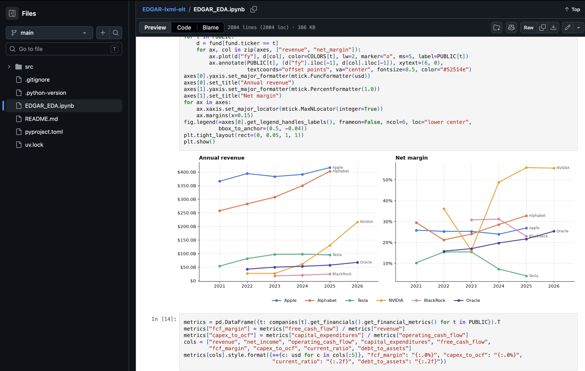

# EDGAR-lxml-elt

This is going to be an end-to-end SEC filing monitor system to create investment advice.

## Data source

All data comes from the U.S. Securities and Exchange Commission's
[EDGAR](https://www.sec.gov/edgar/search/) system: Form 4 insider trades, 8-K events, 10-K XBRL financials,
13F-HR institutional holdings and Form D private offerings. Requests follow the SEC's
[fair access policy](https://www.sec.gov/os/accessing-edgar-data) (declared User-Agent, at most 10 requests/second).
